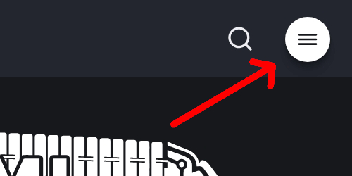
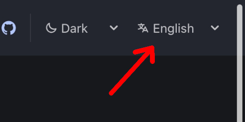

import { Card, CardGrid } from '@astrojs/starlight/components';

### This website is available in two languages [ไปหน้าภาษาไทย](/th)

| Mobile | Desktop |
| --- | --- |
|  |  |

## Apps using ThaiMusicXML

<CardGrid>
	<Card title="Feature your app here" icon="music">
		You can feature your app here if you use ThaiMusicXML format.
	</Card>
</CardGrid>
