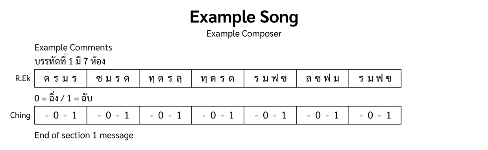

The [Hello World](/en/v0_1/tutorial/1-hello_world/) example used one instrument and one section. This example adds a second instrument, annotations and performance directions in `<structure>`, and a repeat.



## Example XML

```xml
<?xml version="1.0" encoding="UTF-8"?>
<thai-score xmlns="https://thaimusicxml.anan.ovh/ns/0.1" version="0.1">
  <header>
    <title>Example Song</title>
    <composer>Example Composer</composer>
  </header>
  <structure>
    <annotation>Example Comments</annotation>
    <direction>
      <chan value="1" />
      <bpm>65</bpm>
    </direction>
    <annotation>บรรทัดที่ 1 มี 7 ห้อง</annotation>
    <repeat times="2">
      <section id="s1" name="ท่อน 1" />
    </repeat>
    <annotation>End of section 1 message</annotation>
  </structure>
  <ensemble>
    <part id="P1">
      <instrument-name>Ranat Ek</instrument-name>
      <instrument-short-name>R.Ek</instrument-short-name>
    </part>
    <part id="P2" type="unpitched">
      <instrument-name>Ching</instrument-name>
    </part>
  </ensemble>
  <part-data part="P1">
    <section-ref section="s1">
      <line number="1">
        <measure number="1"><note pitch="ด"/><note pitch="ร"/><note pitch="ม"/><note pitch="ร"/></measure>
        <measure number="2"><note pitch="ซ"/><note pitch="ม"/><note pitch="ร"/><note pitch="ด"/></measure>
        <measure number="3"><note pitch="ทฺ"/><note pitch="ด"/><note pitch="ร"/><note pitch="ลฺ"/></measure>
        <measure number="4"><note pitch="ทฺ"/><note pitch="ด"/><note pitch="ร"/><note pitch="ด"/></measure>
        <measure number="5"><note pitch="ร"/><note pitch="ม"/><note pitch="ฟ"/><note pitch="ซ"/></measure>
        <measure number="6"><note pitch="ล"/><note pitch="ซ"/><note pitch="ฟ"/><note pitch="ม"/></measure>
        <measure number="7"><note pitch="ร"/><note pitch="ม"/><note pitch="ฟ"/><note pitch="ซ"/></measure>
      </line>
    </section-ref>
  </part-data>
  <part-data part="P2">
    <section-ref section="s1">
      <annotation>0 = ฉิ่ง / 1 = ฉับ</annotation>
      <line number="1">
        <measure number="1"><rest/><note sound="0"/><rest/><note sound="1"/></measure>
        <measure number="2"><rest/><note sound="0"/><rest/><note sound="1"/></measure>
        <measure number="3"><rest/><note sound="0"/><rest/><note sound="1"/></measure>
        <measure number="4"><rest/><note sound="0"/><rest/><note sound="1"/></measure>
        <measure number="5"><rest/><note sound="0"/><rest/><note sound="1"/></measure>
        <measure number="6"><rest/><note sound="0"/><rest/><note sound="1"/></measure>
        <measure number="7"><rest/><note sound="0"/><rest/><note sound="1"/></measure>
      </line>
    </section-ref>
  </part-data>
</thai-score>
```

## Header

The `<header>` can include a `<composer>` alongside `<title>`:

```xml
<header>
  <title>Example Song</title>
  <composer>Example Composer</composer>
</header>
```

## Structure

The `<structure>` element can contain several child types that describe the score layout:

```xml
<structure>
  <annotation>Example Comments</annotation>
  <direction>
    <chan value="1" />
    <bpm>65</bpm>
  </direction>
  <annotation>บรรทัดที่ 1 มี 7 ห้อง</annotation>
  <repeat times="2">
    <section id="s1" name="ท่อน 1" />
  </repeat>
  <annotation>End of section 1 message</annotation>
</structure>
```

- **`<annotation>`**: Free-form comments that can appear anywhere. Playback ignores them. An annotation in `<structure>` applies to the whole score; one inside a `<section-ref>` applies to that part only. It can contain plain text, which is left aligned, or up to one `<text>` child for each alignment:

  ```xml
  <annotation>
    <text align="left">ท่อน 1</text>
    <text align="center">Lao Duang Duen</text>
    <text align="right">หน้า 1</text>
  </annotation>
  ```

  The `align` value can be `left`, `center`, or `right`. Do not mix plain text with `<text>` children.

- **`<direction>`**: Performance directions. This example sets the ชั้น (`<chan>`) and tempo (`<bpm>`). ชั้น (chan) is the Thai rhythmic layer system. `value="1"` means ชั้นเดียว.
- **`<section>`**: A named section. Wrapping it in a **`<repeat>`** plays it more than once. Repeats nest, so layering them multiplies the play count.

Line and measure numbers are local to their parent elements. Lines start at `1` in each `<section-ref>`, and measures start at `1` in each `<line>`:

```xml
<section-ref section="s1">
  <line number="1">
    <measure number="1">...</measure>
    <measure number="2">...</measure>
  </line>
  <line number="2">
    <measure number="1">...</measure>
  </line>
</section-ref>

<section-ref section="s2">
  <line number="1">
    <measure number="1">...</measure>
  </line>
</section-ref>
```

A section's order comes from its position among the `<section>` elements in `<structure>`, not from an attribute. That order does not continue line or measure numbering across sections, and repeating a section does not change these numbers either.

## Multiple instruments

The `<ensemble>` can list multiple parts:

```xml
<ensemble>
  <part id="P1">
    <instrument-name>Ranat Ek</instrument-name>
  </part>
  <part id="P2" type="unpitched">
    <instrument-name>Ching</instrument-name>
  </part>
</ensemble>
```

Each instrument gets its own `<part-data>` element naming it through the `part` attribute. Here, P1 is a Ranat Ek (ระนาดเอก, a Thai xylophone) and P2 is a Ching (ฉิ่ง, small cymbals). P2 has `type="unpitched"`, so its notes use `sound` instead of `pitch`.

## Part data

Each `<part-data>` links to a section through `<section-ref>`. The Ching part includes an annotation explaining its notation:

```xml
<part-data part="P2">
  <section-ref section="s1">
    <annotation>0 = ฉิ่ง / 1 = ฉับ</annotation>
    <line number="1">
      <measure number="1"><rest/><note sound="0"/><rest/><note sound="1"/></measure>
      ...
    </line>
  </section-ref>
</part-data>
```

An annotation inside a `<section-ref>` applies to that part alone, so this one documents the Ching notation convention without cluttering the other instruments: `0` means ฉิ่ง (open) and `1` means ฉับ (closed).
