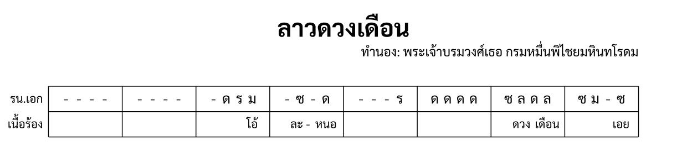

import ExampleXml from "@/components/ExampleXml.astro";

This page adds a vocal part. Thai lyrics are notated as a `<part>` with `type="lyric"`, using `<syllable>` elements instead of `<note>`.



## A lyric part

A lyric part is an ordinary part that takes its own row in the score. Setting `type="lyric"` tells the renderer to expect syllables rather than notes:

```xml
<part id="P2" type="lyric">
  <instrument-name>เนื้อร้อง</instrument-name>
</part>
```

The `<part-data>` follows the same structure as any other part: `<section-ref>`, `<line>`, `<measure>`. The difference is what goes inside the measures.

## Syllables

`<syllable>` holds one word or syllable of Thai text. Thai is sung a syllable at a time, so each syllable gets its own element:

```xml
<measure number="4">
  <rest/><syllable>ละ -</syllable><rest/><syllable>หนอ</syllable>
</measure>
```

A hyphen at the end of a syllable (ละ -) indicates the word continues into the next syllable. The hyphen is part of the text content, not a special syntax.

## Rests in lyric measures

A `<rest>` in a lyric measure means nothing is sung on that beat. The reading is the same as an instrumental rest: no attack. In vocal music this is called เอื้อน, a melodic ornament where the singer holds the previous note or pauses.

## The counting rule

A lyric measure's items (syllables and rests) distribute across the measure in one of two ways:

**Match the beat count.** If the measure has four beats and four items, each item takes one beat:

```xml
<measure number="1">
  <rest/><syllable>ดวง</syllable><rest/><syllable>เดือน</syllable>
</measure>
```

Four items, four beats. ดวง falls on beat 2, เดือน on beat 4.

**Fewer items than beats.** If the measure has four beats but only two items, the items centre in the cell:

```xml
<measure number="3">
  <syllable>หอม</syllable><syllable>กลิ่น</syllable>
</measure>
```

Two items in a four-beat measure. They centre, sitting roughly on beats 2 and 3. Both are ordinary ways to write a vocal line; the choice is the arranger's.

## Example file

This tutorial file has a ระนาดเอก part and a lyric part for ท่อน 1, line 1. The lyrics enter in measure 3 with "โอ้", then "ละ - หนอ" in measure 4, with rests where the singer pauses.

<ExampleXml file="tutorial8-lyrics.txml" />

---

Next, see [Marking the score](/en/v0_1/tutorial/9-marking_the_score/) for bow spans, cued passages, annotations, and metadata.

:::note[Elements introduced]
[`type="lyric"`](/en/v0_1/reference/elements/part/#part-types), [`<syllable>`](/en/v0_1/reference/elements/syllable/)
:::

[Try it in the Playground](/en/playground/)
