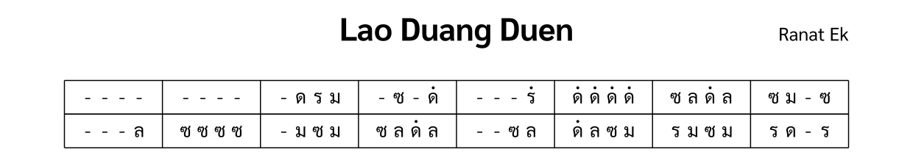

import ExampleXml from "@/components/ExampleXml.astro";

This example shows a simple score for one instrument: a Ranat Ek (ระนาดเอก) playing the first two lines of Lao Duang Duen.



## Example XML

<ExampleXml file="tutorial1-hello-world.txml" />

## Explanations

The following sections explain each element.

```xml
<?xml version="1.0" encoding="UTF-8"?>
```

This XML declaration identifies the document as XML and specifies UTF-8 encoding.

```xml
<thai-score xmlns="https://thaimusicxml.anan.ovh/ns/1" version="1.0">
```

The `<thai-score>` element is the root of a ThaiMusicXML document. The `xmlns` attribute declares the ThaiMusicXML namespace, which is how tools tell these elements apart from any other XML vocabulary and how they decide whether they can read the file at all. `version` records the exact release it follows.

```xml
<header>
  <title>Lao Duang Duen</title>
</header>
```

The `<header>` element contains score metadata. It must include a `<title>`, which is the title of a Thai song in this example. It can also carry a `<composer>` and a `<tuning>`.

```xml
<structure>
  <section id="s1" name="ท่อน 1" />
</structure>
```

The `<structure>` element defines the score layout. Each `<section>` has an `id` that `<section-ref>` uses later to attach music data, and an optional `name` label for readers. A section's order in the score is its position among the `<section>` elements in `<structure>`.

```xml
<ensemble>
  <part id="P1">
    <instrument-name>Ranat Ek</instrument-name>
  </part>
</ensemble>
```

The `<ensemble>` element lists the instruments. Each `<part>` has a unique `id` and an `<instrument-name>`. This example has one Ranat Ek (ระนาดเอก, a Thai xylophone).

```xml
<part-data part="P1">
  <section-ref section="s1">
    <line number="1">
      <measure number="1">
        <rest/><rest/><rest/><rest/>
      </measure>
      <measure number="2">
        <rest/><rest/><rest/><rest/>
      </measure>
      <measure number="3">
        <rest/><note pitch="ด"/><note pitch="ร"/><note pitch="ม"/>
      </measure>
      ...
    </line>
  </section-ref>
</part-data>
```

The `<part-data>` element holds the music for a part. Its `part` attribute names a part in `<ensemble>`. Inside it, `<section-ref>` links to a section in `<structure>`. The music is organized into `<line>` elements, each containing `<measure>` elements with a `number` attribute.

Notes use Thai scale names in the `pitch` attribute. Each degree has three interchangeable single-character spellings, so `pitch="1"`, `pitch="D"`, and `pitch="ด"` all name the same note. This piece uses five of the seven degrees:

| Number | Thai | Romanized | Solfège |
| ------ | ---- | --------- | ------- |
| 1      | ด    | D         | Do      |
| 2      | ร    | R         | Re      |
| 3      | ม    | M         | Mi      |
| 4      | ฟ    | F         | Fa      |
| 5      | ซ    | S         | Sol     |
| 6      | ล    | L         | La      |
| 7      | ท    | T         | Ti      |

The full pitch table and octave marks are covered later in the tutorial (page 4, Notes, rests, and octaves).

```xml
<rest/>
```

A rest is a self-closing element with no attributes. It takes one beat, the same as a note, and means the instrument strikes nothing new on that beat. Thai notation has no sustain marking, so a note left ringing under a following rest is simply how the instrument behaves.

This is a complete ThaiMusicXML file. Next, see [File Structure](/en/v1_0/tutorial/2-file_structure/) to learn how to add multiple instruments, sections, and performance directions.

:::note[Elements introduced]
[`<thai-score>`](/en/v1_0/reference/elements/thai-score/), [`<header>`](/en/v1_0/reference/elements/header/), [`<title>`](/en/v1_0/reference/elements/title/), [`<structure>`](/en/v1_0/reference/elements/structure/), [`<section>`](/en/v1_0/reference/elements/section/), [`<ensemble>`](/en/v1_0/reference/elements/ensemble/), [`<part>`](/en/v1_0/reference/elements/part/), [`<part-data>`](/en/v1_0/reference/elements/part-data/), [`<section-ref>`](/en/v1_0/reference/elements/section-ref/), [`<line>`](/en/v1_0/reference/elements/line/), [`<measure>`](/en/v1_0/reference/elements/measure/), [`<note>`](/en/v1_0/reference/elements/note/), [`<rest>`](/en/v1_0/reference/elements/rest/)
:::

[Try it in the Playground](/en/playground/)
