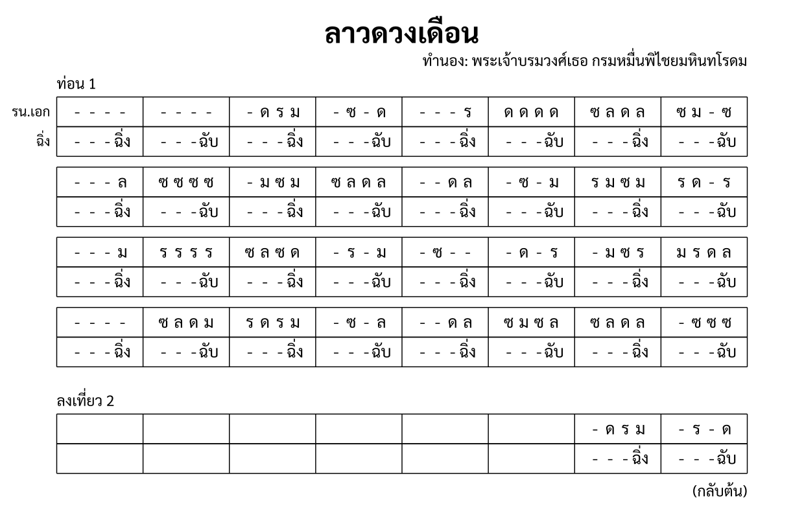

import ExampleXml from "@/components/ExampleXml.astro";

The [Hello World](/en/v1_0/tutorial/1-hello_world/) example used one instrument and one section. This page adds a second instrument, performance directions, annotations, and a repeat, using the real ลาวดวงเดือน (Lao Duang Duen).



## Example XML

<ExampleXml file="tutorial2-file-structure.txml" />

## Header

The `<header>` can include a `<composer>` alongside `<title>`:

```xml
<header>
  <title>ลาวดวงเดือน</title>
  <composer><text align="right">ทำนอง: พระเจ้าบรมวงศ์เธอ กรมหมื่นพิไชยมหินทโรดม</text></composer>
</header>
```

Like `<annotation>`, `<composer>` can hold plain text or a `<text>` child with an `align` attribute. Here the composer line is right-aligned.

## Structure

The `<structure>` element holds the score layout. It can contain annotations, performance directions, sections, and repeats:

```xml
<structure>
  <direction>
    <nathap value="ลาว" />
    <chan value="2" />
    <bpm>60</bpm>
  </direction>
  <repeat times="2">
    <annotation>ท่อน 1</annotation>
    <section id="s1" name="ท่อน 1" />
    <annotation>
      <text align="right">(กลับต้น)</text>
    </annotation>
  </repeat>
</structure>
```

- **`<direction>`**: Performance directions that apply to the whole score.
  - `<nathap>` names the drum cycle, here หน้าทับลาว.
  - `<chan>` sets the ชั้น (rhythmic layer). `value="2"` means สองชั้น. ชั้น is not tempo; it is the spacing of the ฉิ่ง cycle. See [The score model](/en/v1_0/tutorial/3-the_score_model/) for the distinction.
  - `<bpm>` fixes the tempo at 60 beats per minute.
- **`<repeat times="2">`**: Wrapping a section in `<repeat>` plays it more than once. Here ท่อน 1 plays twice.
- **`<annotation>`**: Free-form text. Inside `<structure>`, annotations label sections and add performance notes. The `<text align="right">(กลับต้น)</text>` annotation tells the player to return to the beginning.

## Line and measure numbering

Line and measure numbers are local to their parent. Lines start at `1` in each `<section-ref>`, and measures start at `1` in each `<line>`:

```xml
<section-ref section="s1">
  <line number="1">
    <measure number="1">...</measure>
    <measure number="2">...</measure>
  </line>
  <line number="2">
    <measure number="1">...</measure>
  </line>
</section-ref>
```

A section's order comes from its position in `<structure>`, not from an attribute. Repeating a section does not change line or measure numbers. The second playthrough restarts at line 1, measure 1. See [Sections, repeats, and endings](/en/v1_0/tutorial/6-sections_repeats_endings/) for nested repeats and `<line-repeat>`.

## Multiple instruments

The `<ensemble>` can list multiple parts:

```xml
<ensemble>
  <part id="P1">
    <instrument-name>ระนาดเอก</instrument-name>
    <instrument-short-name>รน.เอก</instrument-short-name>
  </part>
  <part id="P2" type="unpitched">
    <instrument-name>ฉิ่ง</instrument-name>
  </part>
</ensemble>
```

P1 is a ระนาดเอก (Ranat Ek, a Thai xylophone). `<instrument-short-name>` gives a shorter label for tight layouts.

P2 is a ฉิ่ง (Ching, small cymbals). Adding `type="unpitched"` means its notes use `sound` instead of `pitch`:

```xml
<rest/><rest/><rest/><note sound="ฉิ่ง"/>
```

`sound="ฉิ่ง"` is the open stroke and `sound="ฉับ"` is the closed stroke. This piece is สองชั้น, so the ฉิ่ง plays one stroke per measure, alternating ฉิ่ง and ฉับ every measure. The three rests before each stroke fill the other three slots.

## Part data

Each instrument gets its own `<part-data>` element. The `part` attribute links back to a `<part>` in `<ensemble>`:

```xml
<part-data part="P1">
  <section-ref section="s1">
    <line number="1">
      <measure number="1"><rest/><rest/><rest/><rest/></measure>
      <measure number="2"><rest/><rest/><rest/><rest/></measure>
      <measure number="3"><rest/><note pitch="ด"/><note pitch="ร"/><note pitch="ม"/></measure>
      <measure number="4"><rest/><note pitch="ซ"/><rest/><note pitch="ด"/></measure>
      ...
    </line>
  </section-ref>
</part-data>
```

Every `<part-data>` follows the same structure: `<section-ref>` linking to a section, then `<line>` and `<measure>` elements. Each measure holds exactly four note slots. This piece has four beats per measure, and each beat is one slot.

The first two measures of line 1 are all rests. The ระนาดเอก enters in measure 3. A rest means the instrument strikes nothing new on that beat; it is not silence.

---

Next, see [The score model](/en/v1_0/tutorial/3-the_score_model/) for the conceptual foundations that make these elements work the way they do.

:::note[Elements introduced]
[`<composer>`](/en/v1_0/reference/elements/composer/), [`<direction>`](/en/v1_0/reference/elements/direction/), [`<nathap>`](/en/v1_0/reference/elements/nathap/), [`<chan>`](/en/v1_0/reference/elements/chan/), [`<bpm>`](/en/v1_0/reference/elements/bpm/), [`<repeat>`](/en/v1_0/reference/elements/repeat/), [`<annotation>`](/en/v1_0/reference/elements/annotation/), [`<text>`](/en/v1_0/reference/elements/text/), [`<instrument-short-name>`](/en/v1_0/reference/elements/instrument-short-name/)
:::

[Try it in the Playground](/en/playground/)
