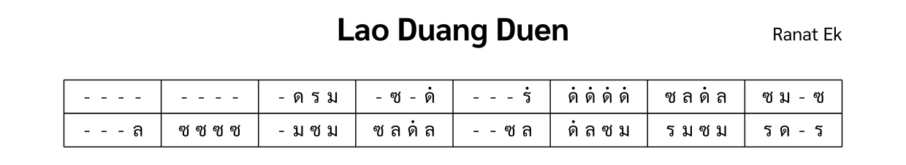

import ExampleXml from "@/components/ExampleXml.astro";

ตัวอย่างนี้เป็นโน้ตง่าย ๆ สำหรับเครื่องดนตรีชิ้นเดียว คือระนาดเอกเล่นสองบรรทัดแรกของเพลงลาวดวงเดือน



## ตัวอย่าง XML

<ExampleXml file="tutorial1-hello-world.txml" />

## คำอธิบาย

ต่อไปนี้คือคำอธิบายของแต่ละองค์ประกอบ

```xml
<?xml version="1.0" encoding="UTF-8"?>
```

บรรทัดนี้คือการประกาศ XML ที่บอกว่าเอกสารนี้เป็นไฟล์ XML และกำหนดให้ใช้การเข้ารหัสแบบ UTF-8

```xml
<thai-score xmlns="https://thaimusicxml.anan.ovh/ns/0.1" version="0.1">
```

องค์ประกอบ `<thai-score>` คือรากของเอกสาร ThaiMusicXML แอตทริบิวต์ `xmlns` ประกาศเนมสเปซ ThaiMusicXML ซึ่งเป็นวิธีที่เครื่องมือใช้แยกองค์ประกอบเหล่านี้ออกจากคำศัพท์ XML อื่น และใช้ตัดสินว่าจะอ่านไฟล์นี้ได้หรือไม่ ส่วน `version` บันทึกว่าไฟล์นี้อ้างอิงสเปกรุ่นใด

```xml
<header>
  <title>Lao Duang Duen</title>
</header>
```

องค์ประกอบ `<header>` เก็บข้อมูลเมตาของโน้ตเพลง ต้องมี `<title>` ซึ่งในตัวอย่างนี้คือชื่อเพลงไทย และอาจมี `<composer>` กับ `<tuning>` เพิ่มเติมได้ด้วย

```xml
<structure>
  <section id="s1" name="ท่อน 1" />
</structure>
```

องค์ประกอบ `<structure>` กำหนดโครงสร้างของโน้ต แต่ละ `<section>` มี `id` ที่ `<section-ref>` ใช้อ้างอิงภายหลังเพื่อแนบข้อมูลดนตรี และอาจมี `name` เป็นป้ายชื่อให้ผู้อ่าน ลำดับของท่อนในโน้ตคือตำแหน่งของ `<section>` แต่ละตัวที่ปรากฏใน `<structure>`

```xml
<ensemble>
  <part id="P1">
    <instrument-name>Ranat Ek</instrument-name>
  </part>
</ensemble>
```

องค์ประกอบ `<ensemble>` แสดงรายชื่อเครื่องดนตรีทั้งหมด `<part>` แต่ละตัวมี `id` ที่ไม่ซ้ำกันและ `<instrument-name>` ตัวอย่างนี้มีระนาดเอกเพียงตัวเดียว

```xml
<part-data part="P1">
  <section-ref section="s1">
    <line number="1">
      <measure number="1">
        <rest/><rest/><rest/><rest/>
      </measure>
      <measure number="2">
        <rest/><rest/><rest/><rest/>
      </measure>
      <measure number="3">
        <rest/><note pitch="ด"/><note pitch="ร"/><note pitch="ม"/>
      </measure>
      ...
    </line>
  </section-ref>
</part-data>
```

องค์ประกอบ `<part-data>` บรรจุข้อมูลดนตรีของพาร์ตหนึ่ง แอตทริบิวต์ `part` ระบุว่าเป็นพาร์ตใดใน `<ensemble>` ส่วน `<section-ref>` ที่อยู่ข้างในเชื่อมโยงไปยังท่อนใน `<structure>` ดนตรีจัดเรียงเป็นองค์ประกอบ `<line>` แต่ละบรรทัดมี `<measure>` พร้อมแอตทริบิวต์ `number`

โน้ตใช้ชื่อระบบเสียงไทยในแอตทริบิวต์ `pitch` แต่ละดีกรีมีการสะกดสามแบบใช้แทนกันได้ `pitch="1"`, `pitch="D"`, และ `pitch="ด"` จึงเป็นโน้ตเดียวกัน:

| ตัวเลข | ไทย | โรมัน | ซอลเฟจ |
| ------ | ---- | --------- | ------- |
| 1      | ด    | D         | Do      |
| 2      | ร    | R         | Re      |
| 3      | ม    | M         | Mi      |
| 4      | ฟ    | F         | Fa      |
| 5      | ซ    | S         | Sol     |
| 6      | ล    | L         | La      |
| 7      | ท    | T         | Ti      |

คอลัมน์ซอลเฟจมีไว้ช่วยอ่านออกเสียงตารางเท่านั้น สามคอลัมน์ทางซ้ายคือค่า `pitch` ที่ใช้ได้จริง

เติม ํ (นิคหิต) ต่อท้ายชื่อโน้ตเพื่อยกขึ้นหนึ่ง octave เติม ฺ (พินทุ) เพื่อลดลงหนึ่ง octave เช่น `ดํ` คือ ด ที่สูงขึ้นหนึ่ง octave และ `ทฺ` คือ ท ที่ต่ำลงหนึ่ง octave ตัวปรับใช้ได้กับการสะกดทั้งสามแบบ

```xml
<rest/>
```

ตัวหยุดเป็นองค์ประกอบปิดตัวเองที่ไม่มีแอตทริบิวต์ ใช้เวลาหนึ่งจังหวะเท่ากับโน้ต หมายความว่าเครื่องดนตรีไม่ตีเสียงใหม่ในจังหวะนั้น โน้ตไทยไม่มีเครื่องหมาย sustain เสียงที่ยังก้องอยู่ใต้ตัวหยุดถัดไปจึงเป็นพฤติกรรมปกติของเครื่องดนตรีนั้นเอง

ไฟล์นี้คือไฟล์ ThaiMusicXML ที่สมบูรณ์แล้ว ขั้นต่อไป ลองดู [โครงสร้างไฟล์](/th/v0_1/tutorial/2-file_structure/) เพื่อเรียนรู้วิธีเพิ่มเครื่องดนตรีหลายตัว หลายท่อน และทิศทางการแสดง
