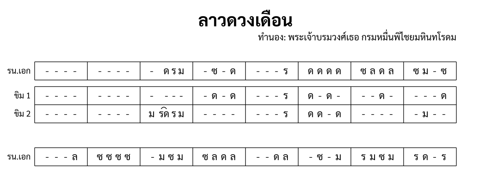

import ExampleXml from "@/components/ExampleXml.astro";

หน้าก่อนแสดงเครื่องดนตรีหนึ่งหรือสองชิ้น หน้านี้เพิ่มหลายพาร์ต แถวเครื่องดนตรีซ้อน และพาร์ตที่ข้ามท่อน



## Ensemble และ part-data

เครื่องดนตรีทุกชิ้นที่ระบุใน `<ensemble>` มีองค์ประกอบ `<part-data>` ของตัวเอง แอตทริบิวต์ `part` เชื่อมกลับ:

```xml
<ensemble>
  <part id="P1">
    <instrument-name>ระนาดเอก</instrument-name>
    <instrument-short-name>รน.เอก</instrument-short-name>
  </part>
  <part id="P2" stack="khim" row="1">
    <instrument-name>ขิม 1</instrument-name>
  </part>
</ensemble>
```

แต่ละ `<part-data>` เก็บข้อมูลดนตรีของเครื่องดนตรีนั้น พาร์ตอาจอ้างอิงท่อนต่างกัน เล่นบรรทัดต่างกัน และมีข้อมูลดนตรีไม่เท่ากัน ตราบเท่าที่ห้องที่ตรงกันตกลงเรื่องจำนวนจังหวะเท่ากัน

## เครื่องดนตรีที่มีหลายบรรทัด

เครื่องดนตรีบางชิ้นเขียนโน้ตข้ามหลายแถว แอตทริบิวต์ `stack` และ `row` เชื่อมพาร์ตให้เป็นเครื่องดนตรีเดียว:

```xml
<part id="P2" stack="khim" row="1">
  <instrument-name>ขิม 1</instrument-name>
</part>
<part id="P3" stack="khim" row="2">
  <instrument-name>ขิม 2</instrument-name>
</part>
```

พาร์ตที่มีค่า `stack` เดียวกันถูกวาดเป็นแถวต่อเนื่องของเครื่องดนตรีเดียว พร้อมป้ายชื่อร่วม แอตทริบิวต์ `row` กำหนดลำดับ: แถว 1 อยู่บน แถว 2 อยู่ล่าง

สำหรับขิม แถวคือระดับเสียง (สูง กลาง ต่ำ) ไม่ใช่มือซ้ายขวา ความสัมพันธ์ทางดนตรีระหว่างแถวเป็นเรื่องของผู้เรียบเรียง ฟอร์แมตเพียงบันทึกว่าแถวไหนอยู่ด้วยกัน

## ชื่อย่อเครื่องดนตรี

`<instrument-short-name>` ให้ป้ายชื่อสั้นสำหรับโน้ตที่มีพื้นที่จำกัด เมื่อชื่อเต็มทำให้โน้ตแน่น เรนเดอร์จะใช้ชื่อสั้นแทน:

```xml
<part id="P1">
  <instrument-name>ระนาดเอก</instrument-name>
  <instrument-short-name>รน.เอก</instrument-short-name>
</part>
```

ชื่อสั้นเป็นทางเลือก ไม่มีก็ได้ เรนเดอร์จะใช้ `<instrument-name>` ทุกที่

## เครื่องดนตรีที่ไม่เล่นบางท่อน

พาร์ตไม่ต้องเล่นทุกท่อน ถ้า `<part-data>` ไม่มี `<section-ref>` สำหรับท่อนใด พาร์ตนั้นหยุดตลอดท่อนนั้น:

```xml
<part-data part="P2">
  <section-ref section="s1">
    <!-- ขิมเล่นในท่อน 1 -->
  </section-ref>
  <!-- ไม่มี section-ref สำหรับ s2: ขิมหยุดท่อน 2 -->
</part-data>
```

พาร์ตยังคงอยู่ใน `<ensemble>` และยังครองแถวของตัวเองในโน้ตที่เรนเดอร์ เพียงแต่แถวนั้นจะว่างเปล่าสำหรับท่อนนี้

## ข้อตกลงเรื่องจำนวนจังหวะ

พาร์ตทุกตัวที่อ้างอิงท่อนเดียวกันต้องตกลงเรื่องจำนวนจังหวะต่อห้อง ถ้าบรรทัด 1 ห้อง 1 ของระนาดเอกมีโน้ตสี่ตัว ขิม 1 ก็ต้องมีสี่จังหวะในบรรทัด 1 ห้อง 1 เช่นกัน (ไม่ว่าจะเป็นโน้ต ตัวหยุด หรือกลุ่ม)

ข้อยกเว้นเดียวคือพาร์ตเนื้อร้อง ห้องเก็บพยางค์ไม่ใช่จังหวะ จำนวนจึงตัดสินว่าคำนั่งตรงไหนในเซลล์ ดู [เนื้อร้อง](/th/v0_1/tutorial/8-lyrics/)

## ไฟล์ตัวอย่าง

ไฟล์นี้มีสามพาร์ต: ระนาดเอก ขิม 1 (stack="khim" row="1") และขิม 2 (stack="khim" row="2") ท่อน 1 มีทั้งสามพาร์ต ท่อน 2 มีแค่ระนาดเอก ขิมทั้งสองไม่มี `<section-ref>` สำหรับท่อน 2 จึงหยุด

<ExampleXml file="tutorial7-ensemble.txml" />

---

ขั้นต่อไป ดู [เนื้อร้อง](/th/v0_1/tutorial/8-lyrics/) สำหรับพาร์ตขับร้อง พยางค์ และกฎการนับ

:::note[องค์ประกอบที่แนะนำ]
[แอตทริบิวต์ `stack`](/th/v0_1/reference/elements/part/#แอตทริบิวต์), [แอตทริบิวต์ `row`](/th/v0_1/reference/elements/part/#แอตทริบิวต์), [`<instrument-short-name>`](/th/v0_1/reference/elements/instrument-short-name/)
:::

[ลองเล่นใน Playground](/th/playground/)
