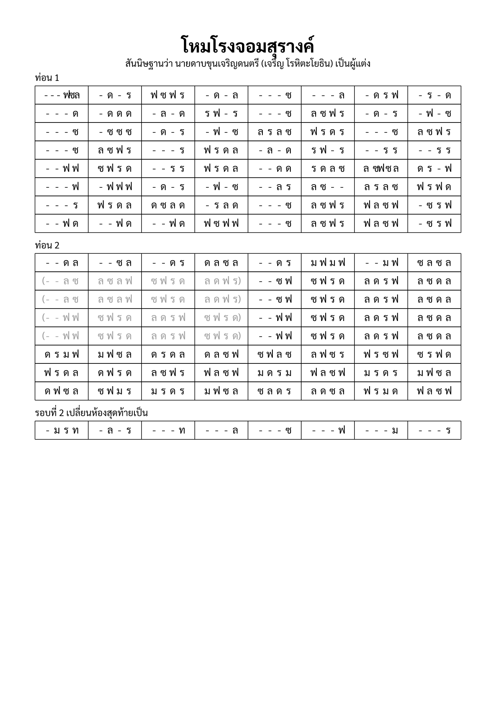

import ExampleXml from "@/components/ExampleXml.astro";

## ผลลัพธ์

## XML

<ExampleXml file="example-chomsurang.txml" />

## หมายเหตุ

ท่อน 2 ต้นฉบับเขียนไว้สองรอบเต็ม "รอบที่ 1" และ "รอบที่ 2" เหมือนกันทุกห้อง
ยกเว้นห้องสุดท้ายห้องเดียว ตรงกับสิ่งที่
[`<repeat>`](/th/v1_0/reference/elements/repeat/) และ
[`<ending>`](/th/v1_0/reference/elements/ending/) มีไว้ใช้พอดี: เขียน section
ครั้งเดียวแล้วครอบด้วย `<repeat times="2">` ส่วนบรรทัดสุดท้ายที่ต่างกันก็เขียน
ซ้ำแค่บรรทัดเดียวใน `<ending pass="2">`

ครอบคลุม:

- [`<repeat times="2">`](/th/v1_0/reference/elements/repeat/) ที่ครอบ
  section พร้อม [`<ending pass="2">`](/th/v1_0/reference/elements/ending/)
  แทนที่เฉพาะบรรทัดสุดท้าย
- ช่วง [`<parenthesis>`](/th/v1_0/reference/elements/parenthesis/) แบบ
  `dim="true"` กำกับช่วงที่คร่อมด้วยวงเล็บในต้นฉบับให้เป็นคิว (cued)
  ไม่ใช่ตัวที่เล่นจริง
- [`<group>`](/th/v1_0/reference/elements/group/) ที่แบ่งจังหวะเป็นสองส่วน
  ในห้องหนึ่ง และแบ่งเป็นสามส่วนในอีกห้องหนึ่ง
- [`<instrument-name>`](/th/v1_0/reference/elements/instrument-name/)
  ที่เว้นว่างไว้ สำหรับแนวทำนองเดียวที่ต้นฉบับไม่ได้ระบุเครื่องดนตรี
