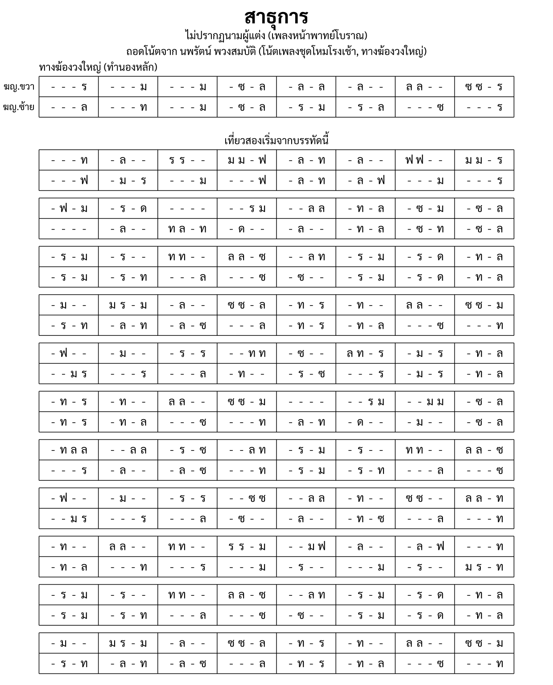

import ExampleXml from "@/components/ExampleXml.astro";

## ผลลัพธ์

หน้า 1 จาก 3 หน้า โน้ตเต็มมีเนื้อหาต่อจากส่วนนำที่แสดงนี้

## XML

<ExampleXml file="example-sathukan.txml" />

## หมายเหตุ

สาธุการเป็นเพลงหน้าพาทย์ที่ตามธรรมเนียมจะบรรเลงตามการให้สัญญาณสด
ไม่ใช่เล่นซ้ำตามจำนวนครั้งที่กำหนดตายตัว โน้ตต้นฉบับ
(โน้ตฆ้องวงใหญ่สองแถว มือขวาอยู่บน มือซ้ายอยู่ล่าง)
ระบุจุดแยกทางการบรรเลงไว้สามจุด ได้แก่ เที่ยวที่สองเริ่มจากตรงไหน
เล่นไปได้ไกลแค่ไหนก่อนจะวกกลับ และเมื่อกลับต้นแล้วจบตรงไหน
โดยเขียนไว้เป็นข้อความกำกับข้างโน้ต ไม่ใช่โครงสร้างตายตัว

โน้ตนี้คงรูปแบบนั้นไว้แทนที่จะบังคับให้เป็น
[`<repeat>`](/th/v1_0/reference/elements/repeat/) และ
[`<ending>`](/th/v1_0/reference/elements/ending/): แต่ละจุดแยกทางเป็นขอบเขตของ
section โดยมีข้อความกำกับต้นฉบับติดมาเป็น
[`<annotation>`](/th/v1_0/reference/elements/annotation/) ระหว่าง section
คำต่อคำ ผู้อ่านจึงได้รับคำสั่งเดียวกับที่นักดนตรีอ่านจากต้นฉบับ

ครอบคลุม:

- [`<section>`](/th/v1_0/reference/elements/section/)
  สี่ส่วนที่แบ่งตรงจุดกำกับในต้นฉบับพอดี โดยมี `<annotation>`
  นำคำกำกับต้นฉบับมาเอง แทนที่จะเข้ารหัสเป็นการเล่นซ้ำ
- แอตทริบิวต์ `stack` และ `row` ของ
  [`<part>`](/th/v1_0/reference/elements/part/)
  ที่เชื่อมฆ้องวงใหญ่ R และ L เป็นสองแถวของเครื่องดนตรีเดียว รูปแบบเดียวกับ
  [แขกบรเทศ](/th/v1_0/reference/examples/khaek-borathes/)
- โน้ตยาวที่ไม่มีตัวปรับ octave ของไทยเลยสักตัว โดย
  [`<note>`](/th/v1_0/reference/elements/note/) ทุกตัวอยู่ในช่วงเสียงเดียว
  ตรงกับต้นฉบับ
- [`<rest>`](/th/v1_0/reference/elements/rest/) ตลอดทั้งเพลง โดยไม่มี
  `<chan>` หรือ `<bpm>`: ต้นฉบับไม่ได้ระบุจังหวะหรือชั้นตายตัว
