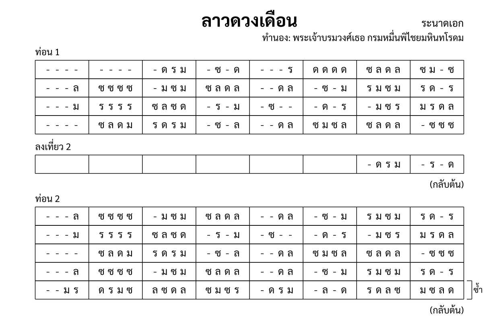

import ExampleXml from "@/components/ExampleXml.astro";

[โครงสร้างไฟล์](/th/v1_0/tutorial/2-file_structure/) แสดงท่อนเดียวที่ซ้ำ หน้านี้เพิ่มหลายท่อน การซ้อนซ้ำ การซ้ำบรรทัด และจุดจบแบบที่สอง ทั้งหมดปรากฏในเพลงลาวดวงเดือน



## หลายท่อน

โน้ตมีหลายท่อนได้ ลำดับมาจากตำแหน่งใน `<structure>` ไม่ใช่จากแอตทริบิวต์:

```xml
<structure>
  <section id="s1" name="ท่อน 1" />
  <section id="s2" name="ท่อน 2" />
  <section id="s3" name="ท่อน 3" />
</structure>
```

ท่อน 1 เล่นก่อน แล้วท่อน 2 แล้วท่อน 3 เปลี่ยนชื่อ `id` หรือย้ายตำแหน่ง `<section>` เปลี่ยนลำดับ `<section-ref>` ของแต่ละท่อนใน `<part-data>` เชื่อมโยงไปยังท่อนผ่าน `id`

## เล่นซ้ำทั้งท่อน

`<repeat>` คลุมรอบท่อนเพื่อเล่นท่อนนั้นมากกว่าหนึ่งครั้ง ไฟล์ลาวดวงเดือนมีซ้ำทุกท่อน:

```xml
<repeat times="2">
  <annotation>ท่อน 1</annotation>
  <section id="s1" name="ท่อน 1" />
  <annotation>
    <text align="right">(กลับต้น)</text>
  </annotation>
</repeat>
```

ท่อน 1 เล่นสองครั้ง หมายเหตุ "(กลับต้น)" บอกผู้เล่นให้กลับไปต้นท่อน การซ้ำซ้อนกันได้ การคลุม `<repeat>` ซ้อนกันคูณจำนวนครั้ง

## การนับเลขห้องและบรรทัด

การนับเลขห้องและบรรทัดภายในองค์ประกอบแม่ของตัวเอง เมื่อท่อนซ้ำ การเล่นรอบที่สองเริ่มนับใหม่จากบรรทัด 1 ห้อง 1 ตัวเลขไม่สะสมข้ามการซ้ำ

```xml
<!-- รอบแรก: บรรทัด 1 ห้อง 1 ถึง 8 -->
<!-- รอบที่สอง: บรรทัด 1 ห้อง 1 ถึง 8 อีกครั้ง -->
```

นี่ทำให้อ้างอิงง่าย "บรรทัด 2 ห้อง 5" หมายความเหมือนกันทุกครั้งที่ท่อนเล่น

## การซ้ำบรรทัด

`<line-repeat>` ซ้ำบรรทัดหนึ่งหรือหลายบรรทัดภายในท่อน โดยไม่ต้องเขียนซ้ำ:

```xml
<section id="s2" name="ท่อน 2">
  <line-repeat first="5" last="5" times="2"/>
</section>
```

นี้ซ้ำบรรทัด 5 ของท่อน 2 สองครั้ง แอตทริบิวต์ `first` และ `last` ระบุช่วงบรรทัด เมื่อค่าเท่ากัน ซ้ำบรรทัดเดียว เมื่อต่างกัน ซ้ำทั้งช่วง

จากลาวดวงเดือน ท่อน 3 ใช้ช่วง:

```xml
<section id="s3" name="ท่อน 3">
  <line-repeat first="1" last="2" times="2"/>
  <line-repeat first="4" last="4" times="2"/>
</section>
```

บรรทัด 1 ถึง 2 ซ้ำสองครั้ง แล้วบรรทัด 4 ซ้ำสองครั้ง `<line-repeat>` เป็นลูกของ `<section>` ไม่ใช่ของ `<structure>`

## จุดจบ (ออก)

บางครั้งบรรทัดสุดท้ายของท่อนต่างกันในการซ้ำรอบสุดท้าย `<ending pass="2">` ให้บรรทัดแบบอื่นที่ใช้เฉพาะรอบที่ระบุ:

```xml
<ending pass="2">
  <annotation>ลงเที่ยว 2</annotation>
  <line number="4">
    <measure number="1"></measure>
    <measure number="2"></measure>
    <measure number="3"></measure>
    <measure number="4"></measure>
    <measure number="5"></measure>
    <measure number="6"></measure>
    <measure number="7"><rest/><note pitch="ด"/><note pitch="ร"/><note pitch="ม"/></measure>
    <measure number="8"><rest/><note pitch="ร"/><rest/><note pitch="ด"/></measure>
  </line>
</ending>
```

`<ending>` แทนที่บรรทัดที่ตรงกันในรอบที่ระบุ รอบแรก บรรทัด 4 ดั้งเดิมเล่นตามที่เขียน รอบที่สอง ห้อง 1 ถึง 6 ว่าง (พาร์ตหยุด) และห้อง 7 ถึง 8 เล่นวลีปิดท้าย หมายเหตุ "ลงเที่ยว 2" ทำเครื่องหมายจุดจบให้ผู้เล่น

`<ending>` เป็นลูกของ `<section-ref>` ไม่ใช่ของ `<section>` แต่ละพาร์ตมีจุดจบของตัวเองสำหรับท่อนเดียวกันได้

## ไฟล์ตัวอย่าง

ไฟล์นี้มีท่อน 1 (ครบทั้ง 4 บรรทัด) และท่อน 2 (5 บรรทัดพร้อมการซ้ำบรรทัดที่ 5) ท่อน 1 มี `<ending pass="2">` บนบรรทัด 4 ทั้งสองท่อนคลุมด้วย `<repeat times="2">`

<ExampleXml file="tutorial6-sections-repeats.txml" />

---

ขั้นต่อไป ดู [เครื่องดนตรีหลายตัวและโน้ตซ้อน](/th/v1_0/tutorial/7-ensembles_stacked/) สำหรับโน้ตที่มีหลายพาร์ตและเครื่องดนตรีที่เขียนข้ามหลายแถว

:::note[องค์ประกอบที่แนะนำ]
[`<section>`](/th/v1_0/reference/elements/section/), [`<repeat>`](/th/v1_0/reference/elements/repeat/), [`<line-repeat>`](/th/v1_0/reference/elements/line-repeat/), [`<ending>`](/th/v1_0/reference/elements/ending/)
:::

[ลองเล่นใน Playground](/th/playground/)
